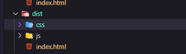

## Minificando Scripts con gulp

1. Para poder montar el autominificador se recomienda la version de node
de v16.16.0

2. Ejecutar en el CMD o PowerShell
   
   **Instala las dependencias**

   `npm install`

3. Dependencias necesarias: (Si por algun error no se llegan a instalar)
   `npm i -g gulp`

   3.1 **Gulp ^4.0.2**  ====> `npm install gulp --save-dev`

   - **gulp-sourcemaps ^3.0.0**
   - **gulp-concat ^2.6.1**
   - **gulp-terser ^2.1.0**
   

   `npm install --save-dev gulp-sourcemaps gulp-concat gulp-terser`

   - **gulp-postcss ^9.0.1**
   - **cssnano ^6.0.1**
   - **autoprefixer ^10.4.14**

   `npm install --save-dev gulp-postcss cssnano autoprefixer`

    
   - **gulp-imagemin ^7.0.0** : Optimiza el tamaño de las imagenes. Se recomienda esta versión porque las versiones posteriores hay un error de una dependencia.

   `npm install --save-dev gulp-imagemin@7.0.0`

   ## Ejecución

   - En el archivo gulpfile.js esta el script que automatiza las tareas de minificacion tanto de css como de js.

      Ejecutar en la consola: `gulp`

   - Pegar en la carpeta css y js los archivos de estilos y/o los scripts que deseamos minificar y gulp se encargará de realizar la minificación por nosotros.
      En la carpeta /dist estarán los archivos minificados.
      

   - Esta en modo watch por lo que si hacemos cambios volverá a compilar los mismos.
